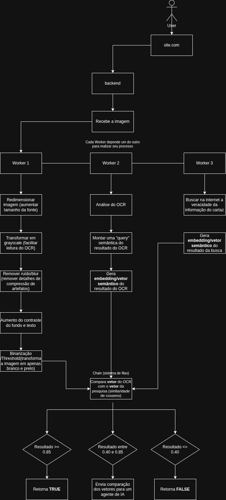

# CheckAI

O CheckAI (**OCR-based Fact Verification System**) é uma extensão de navegador com um sistema de verificação de cartazes na Internet baseada em OCR, retornando True caso a informação esteja correta e False em caso de Fake News.

## Fluxo

